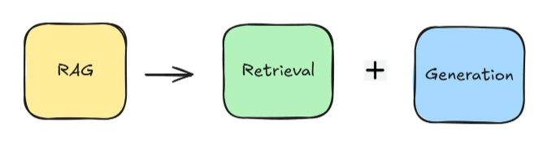
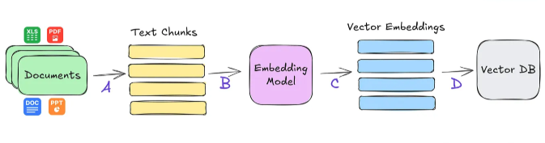
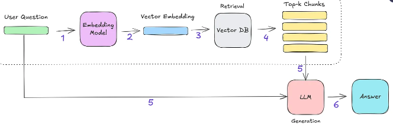
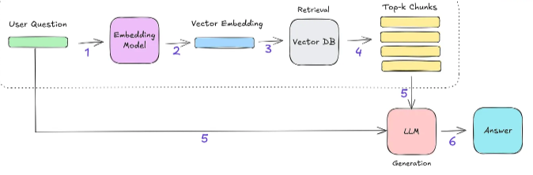
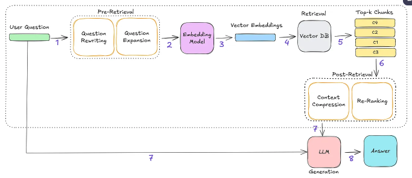

# What is RAG?
To keep it simple, remember this to start with :)

1   - Retrieval: Finding the most relevant documents or information based on the user's question.

2   - Generation: Using the retrieved information, the LLM creates a clear and helpful answer for the user.

# Why do we need RAG?
LLMs like GPT-4 & DeepSeek are mainly trained on public data (Wikipedia, books, Common Crawl, etc.)

These LLMs are static and lack access to proprietary, domain-specific knowledge (internal reports, technical docs, proprietary data)

Result → When asked domain-specific questions, LLMs often hallucinate (generate incorrect or misleading answers)

# How does RAG solve the problem?
RAG addresses this by retrieving relevant documents or information based on the user’s question and providing it to the LLM on the fly.

Reduces hallucination by ensuring the answers are grounded on the retrieved documents.

Supports citations of retrieved documents, enabling users to validate the answers.

# How does RAG work?

RAG can be largely seen as two step process:

    1 - Data Indexing
    
    2 - Retrieval + Generation
# Data Indexing

    A. Start by identifying the documents you want to index, these could be PDFs, Word files, PowerPoint slides, Excel sheets, and more. Once you’ve collected them, the content is broken down into smaller, manageable pieces called chunks.
    
    B. These chunks are then passed through an embedding model.
    
    C. The embedding model converts each chunk into a vector representation that captures its semantic meaning.
    
    D. Finally, the vector embeddings are stored in a vector database, such as Milvus, so they can be quickly searched and retrieved later.

# Retrieval + Generation

1  - When the user asks a question, it’s passed through the same embedding model used during data indexing.

2  - This model converts the question into a vector that captures its semantic meaning.

3  - This question vector is then compared (similarity search) against all the vectors stored in the vector database to find the most similar ones.

4  - The similarity search returns the top-k most relevant chunks of information.

5  - The LLM takes both the original question and these retrieved chunks as input.

6  - Finally, the LLM uses this context to generate a helpful and grounded answer.

Now that you have a basic understanding of how RAG works, let's explore the different architectural approaches.

# RAG Architectures

# 1. Naïve RAG

What we just walked through, retrieving relevant chunks and passing them to the LLM along with the user's question to generate a response is known as Naïve RAG.

# 2. Advanced RAG

Advanced RAG builds on top of Naïve RAG by tackling some of its limitations, especially around how information is retrieved. It does this using a mix of pre-retrieval strategies, post-retrieval strategies and fine tuned embedding model to improve both the quality and usefulness of the context that gets passed to the LLM.

On the pre-retrieval side, the focus is on making the question better before we even look for answers. This might involve rewriting the question, transforming it into a more search-friendly format, or expanding it to include related terms and concepts.

- Query Rewriting: Refines the original query to better align with the retrieval process.

      Fixing grammar or typos
      
      Simplifying complex phrasing
      
      Rephrasing for clarity and conciseness

- Query Expansion: Generates multiple variations of the original query to broaden the scope of retrieval. This helps capture more potentially relevant information.

      Adding synonyms or abbreviation
      
      Reformulating the question in different ways
      
      Running retrieval multiple times using each variation to maximize context coverage

On the post-retrieval side, once we have the relevant chunks, the next challenge is integrating that context effectively with the user’s question. This is where post-retrieval strategies come in. Two common ones are re-ranking and context compression.

- Re-ranking: Reorders the retrieved chunks based on their relevance to the question. The goal is to prioritize the most useful information by placing it at the top (or sometimes end) of the prompt. This improves the likelihood that the model attends to the most important context first.

- Context Compression: Reduces the size of the retrieved content by trimming redundant, low-value, or off-topic information. This helps fit more relevant content into the prompt window and ensures the prompt remains focused and concise.

Fine-Tuning an Embedding Model

In certain specialized domains such as medical, legal, or scientific data standard embedding models may struggle to capture domain-specific language and nuances effectively. In these cases, fine-tuning a custom embedding model on domain-relevant texts can significantly improve retrieval quality.

    Captures specialized terminology and concepts more accurately
    
    Improves semantic similarity matching within niche datasets
    
    Enhances relevance and precision of retrieved results

# 3. Graph RAG

Graph RAG is like a smarter version of the Naïve RAG. Normally, RAG retrieves in relevant information by searching through a vector database (Fig 3.) basically, it finds chunks of text that seem similar to what you're asking. But Graph RAG takes it a step further by integrating knowledge graphs (KGs) into the retrieval process.

These knowledge graphs represent entities and their interconnections, enabling more contextualized, precise, and semantically rich retrieval. By incorporating this relational structure, Graph RAG facilitates a deeper understanding of the information space, resulting in more accurate answers.

# 4. Hybrid RAG

Hybrid RAG systems step things up by combining the best of both worlds semantic understanding and structured context to deliver more accurate and insightful answers.

Naïve RAG + Graph RAG: Combines Naïve vector-based search with graph-based methods to capture both conceptual similarity and relational context, enabling deeper understanding.

Naïve RAG + Keyword Search: Combines semantic retrieval with traditional keyword-based search (like looking for exact words).

# 5. Multimodal RAG

Multimodal RAG is an advanced approach to information retrieval and generation that combines the strengths of multiple content types e.g. text and images. Naive RAG systems focus on text, Multimodal RAG uses both textual and visual information, providing a more comprehensive and context-rich foundation for generating answer.

# 6.Agentic RAG

Agentic RAG architectures revolve around agents that manage how external information is retrieved and used in generating answers. In a Single-Agent RAG, a single agent acts as a router to decide which knowledge source to query. In Multi-Agent RAG, multiple specialized agents are coordinated, usually by a master agent, to handle more complex or diverse information retrieval tasks.

    Single-Agent RAG: Acts as a router to select from multiple knowledge sources or tools (e.g., databases, APIs, web). Combines retrieval, and response generation in one agent.
    
    Multi-Agent RAG: Involves a master agent coordinating specialized agents for different data sources (e.g., databases, APIs, web). Enables modular and scalable retrieval workflows.
